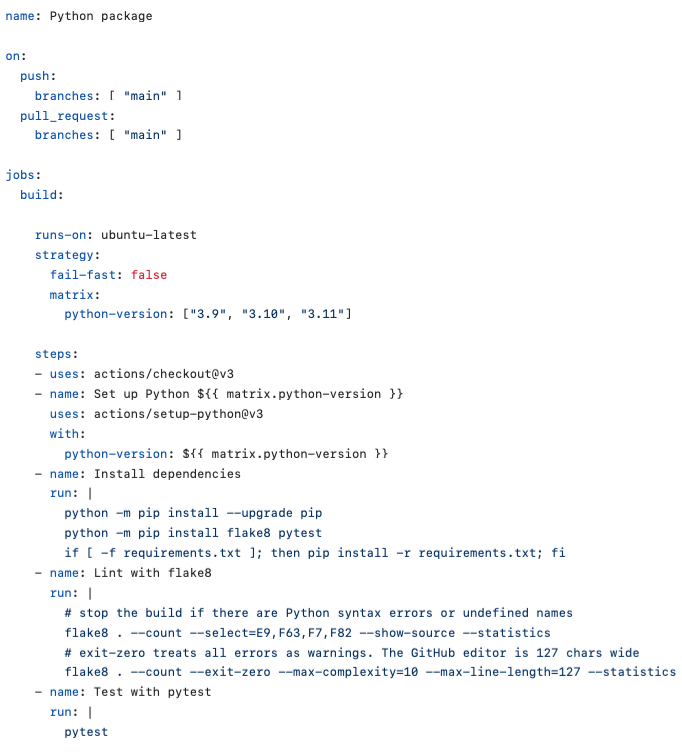

# GitHub Actions Tutorial

This tutorial provides a summary of the GitHub Actions workflow based on the content covered in [this YouTube tutorial](https://www.youtube.com/watch?v=R8_veQiYBjI).

## Overview

GitHub Actions is a powerful feature that allows you to automate your software development workflows. It revolves around the concept of workflows, which are defined in YAML files. These workflows can be triggered by various events such as code pushes, pull requests, and more.

The most common use case for GitHub Actions is Continuous Integration/Continuous Deployment (CI/CD). This involves committing code, saving it, building, testing, and deploying it automatically. Compared to other tools like Jenkins, GitHub Actions has the advantage of being integrated directly into your code repository, making pipeline setup easier and requiring no additional personnel for configuration. It also facilitates seamless integration with various technologies.

## Getting Started

To set up GitHub Actions for your repository, follow these steps:

1. Create a new repository.
2. Click on the "Actions" button at the top of your GitHub repository.

   

3. Scroll down to see workflow templates categorized for deployment, CI workflows, combinations (e.g., Java with Maven), and automation of specific steps in your process (e.g., sending greetings to new contributors).

## Example Workflow

Let's create a simple example workflow:

1. Click on "Set up a workflow yourself" and it will create a YAML file for the workflow configuration.

   

2. The YAML file includes different actions with details:

   - `name`: Specifies the name of the action.
   - `on`: Indicates the triggers, e.g., `push: branches: [master]`.
   - `jobs`: Defines the jobs to be executed.

   ```yaml
   name: Example Workflow

   on:
     push:
       branches:
         - master

   jobs:
     build:
       runs-on: ubuntu-latest
       steps:
         - uses: action/checkout
         - name: Set up environment
           uses: actions/setup-python
           with:
             python-version: 3.8
         - name: Next task
           run: echo "Running a command line command"
         - name: Build code
           run: python file.py
   ```

3. Explore the details of each action and highlight the commands in the workflow.

## Execution and Dependencies

GitHub Actions are executed on GitHub servers, and GitHub manages the process for you. When a new workflow is created, a new GitHub runner is spun up to run the tasks. To handle dependencies between jobs, you can use the `needs` keyword.

```yaml
jobs:
  build:
    runs-on: ubuntu-latest
    steps:
      # ...

  publish:
    needs: build
    runs-on: ubuntu-latest
    steps:
      # ...
```

If you want to run the workflow on different operating systems simultaneously, use the `strategy: matrix` configuration.

```yaml
jobs:
  build:
    runs-on: ${{ matrix.os }}
    strategy:
      matrix:
        os: [ubuntu-latest, windows-latest, macos-latest]
    steps:
      # ...
```

## Docker Image Build and Publish

Let's extend our example to build a Docker image from code and publish it on JFrog:

```yaml
jobs:
  build:
    runs-on: ubuntu-latest
    steps:
      - uses: actions/checkout

  publish:
    needs: build
    runs-on: ubuntu-latest
    steps:
      - name: Docker Build and Publish
        uses: docker/build-push-action@v2
        with:
          username: ${{ secrets.DOCKER_USERNAME }}
          password: ${{ secrets.DOCKER_PASSWORD }}
          repository: your-docker-repo
          tag_with_ref: true
```

For security, add Docker credentials as secrets in your repository settings.

1. Go to your repository on GitHub.
2. Navigate to "Settings" -> "Secrets" -> "New repository secret."
3. Add `DOCKER_USERNAME` and `DOCKER_PASSWORD` with your Docker Hub credentials.

Now, your GitHub Actions workflow is set up to build and publish a Docker image.

**Note:** Ensure you replace placeholders like `your-docker-repo` with your actual values.

This provides a basic guide to GitHub Actions, and you can further customize workflows based on your project requirements. Explore the GitHub Marketplace for additional actions to enhance your automation process.
